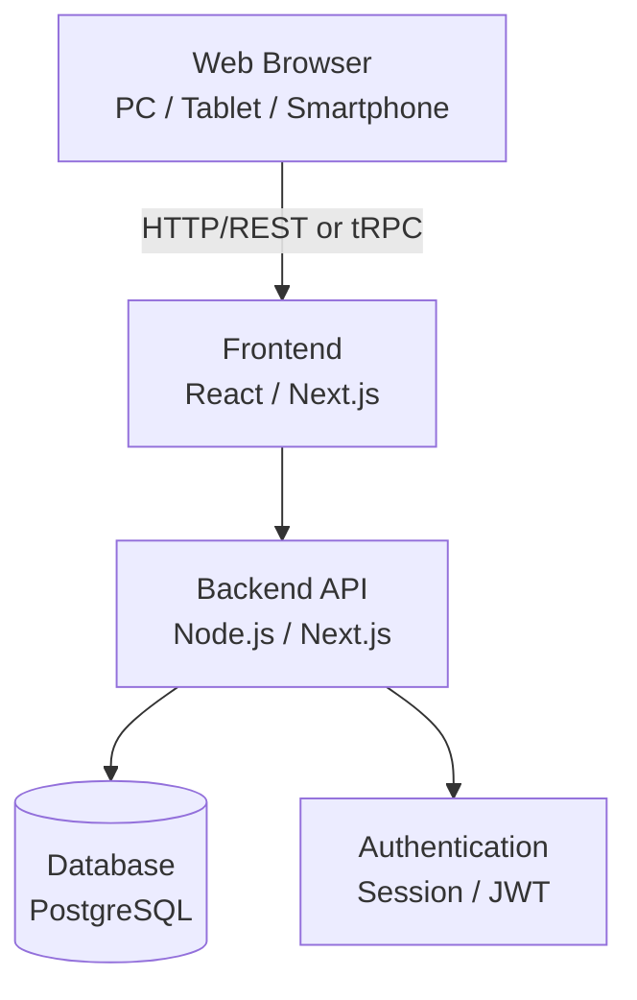

# システムアーキテクチャ設計書

## 1. 概要
本ドキュメントは、就労継続支援A型事業所向け「期限・進捗管理システム」のシステム構成および技術スタックを定義する。
AI（エージェント）が自律的かつ効率的に開発を進めるための指針となる。

## 2. 技術スタック（推奨）

要件定義書における「爆速UI」「レスポンシブWebデザイン」「クラウド型」を実現するため、以下のモダンなWeb技術スタックを採用する。

### フロントエンド
* **フレームワーク**: Next.js (React) または Vite + React
  * 理由: コンポーネント指向でのUI構築が容易。状態管理（タスクの進行など）を効率的に行えるため。
* **スタイリング**: Tailwind CSS
  * 理由: 独自のデザインシステムを迅速に構築でき、レスポンシブ対応が容易なため。
* **UIコンポーネント**: Shadcn UI または MUI
  * 理由: アクセシビリティに配慮した高品質なコンポーネント（特にカレンダーや入力フォーム）を素早く導入するため。

### バックエンド（APIサーバー）
* **フレームワーク**: Next.js API Routes / Server Actions または Node.js (Express/Fastify)
  * 理由: フロントエンドとTypeScriptの型を共有でき、開発速度が向上するため。
* **言語**: TypeScript
  * 理由: 型安全性を保ち、開発中のバグを未然に防ぎ、AIによるコード生成精度を高めるため。

### データベース
* **RDBMS**: PostgreSQL
  * 理由: 複雑な日付計算やリレーション（事業所・利用者・タスク・履歴）を堅牢に管理するため。JSON形式での柔軟なマスタデータ保存にも対応可能。
* **ORM**: Prisma または Drizzle ORM
  * 理由: TypeScriptとの親和性が高く、スキーマ定義から型を自動生成できるため。

### インフラ・ホスティング
* **フロントエンド＆バックエンド**: Vercel または サーバーレス環境
* **データベース**: Supabase または Vercel Postgres

## 3. システム構成図（概念）



## 4. ディレクトリ構成（案）

```text
/
├── public/             # 静的アセット
├── src/
│   ├── app/            # Next.js App Router (ページ群)
│       ├── (auth)/     # ログイン関連
│       ├── dashboard/  # ダッシュボード（タスク一覧）
│       ├── clients/    # 利用者一覧・詳細・タスク管理
│       └── settings/   # マスタ設定（タスク定義など）
│   ├── components/     # UIコンポーネント（共通・機能別）
│   ├── lib/            # 共通ユーティリティ（日付計算ロジック等）
│   ├── server/         # バックエンドロジック・API
│   └── types/          # TypeScript型定義
├── prisma/             # DBスキーマ定義
└── docs/               # 開発ドキュメント群（本ディレクトリ）
```
