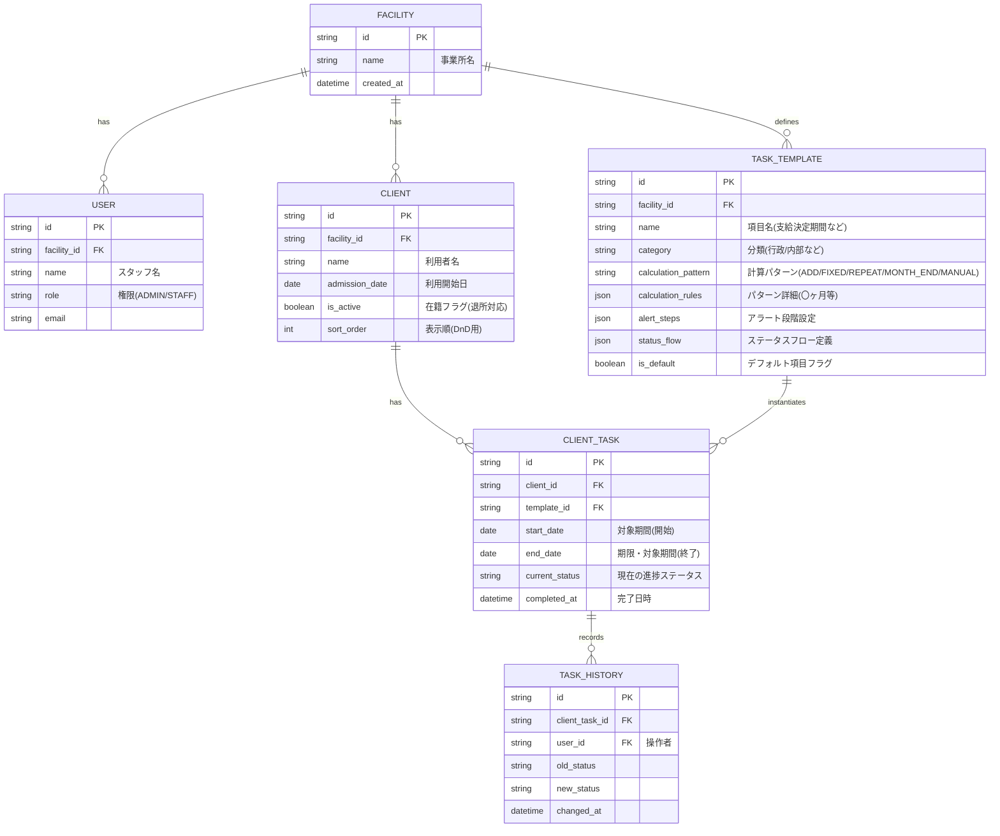

# データベーススキーマ設計書

## 1. 概要
本ドキュメントは、「期限・進捗管理システム」のデータモデルを定義する。
事業所ごとの柔軟な「計算パターン」「ステータスフロー」を実現するためのマスタ構造と、各利用者に紐付く実際の「タスクデータ」を分離して管理する。

## 2. ER図（概念モデル）

## 3. テーブル詳細（主要部分）

### 3.1 `TaskTemplates` (タスクマスタ)
事業所管理者が自由に設定できる「期限ルールのマスタ」。
* `calculation_pattern`: 加算(`ADD`)、固定(`FIXED`)、反復(`REPEAT`)、月末丸め(`MONTH_END`)、ルールなし(`MANUAL`)のEnum。
* `calculation_rules`: JSON形式。例: `{"unit": "month", "value": 12}` (12ヶ月後)
* `status_flow`: JSON形式で完了までのステップを保持。例: `["未対応", "面談済み", "書類作成済み", "署名・押印済み"]`

### 3.2 `ClientTasks` (利用者タスク)
マスタを元に、利用者ごとの「実際の期限や進捗」を管理するテーブル。
* `end_date`: この日付と現在の日付を比較し、`TaskTemplates`の`alert_steps`に基づいて「黄・橙・赤」のアラートを判定する。
* ダッシュボードでは、`is_active`がtrueの利用者のうち、`current_status`が完了以外で、かつアラート期間に突入しているタスクを抽出して表示する。
